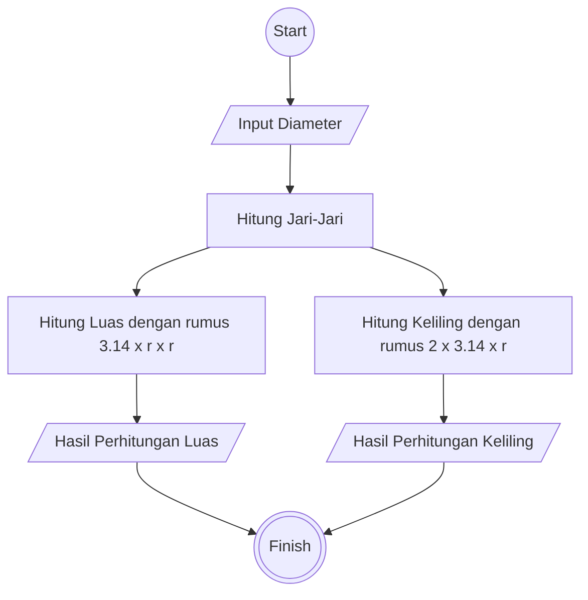

# Javascript

## Hitung Luas dan Keliling Lingkaran

```mermaid
flowchart TD
A@{shape: circle, label: 'Start'}
B@{shape: lean-r, label: 'Input Diameter'}
C@{shape: rectangle, label: 'Hitung Jari-Jari'}
D@{shape: rectangle, label: 'Hitung Luas dengan rumus 3.14 x r x r'}
E@{shape: rectangle, label: 'Hitung Keliling dengan rumus 2 x 3.14 x r'}
F@{shape: lean-r, label: 'Hasil Perhitungan Luas'}
G@{shape: lean-r, label: 'Hasil Perhitungan Keliling'}
Z@{shape: dbl-circ, label: 'Finish'}

A-->B-->C
C-->D-->F-->Z
C-->E-->G-->Z
```
