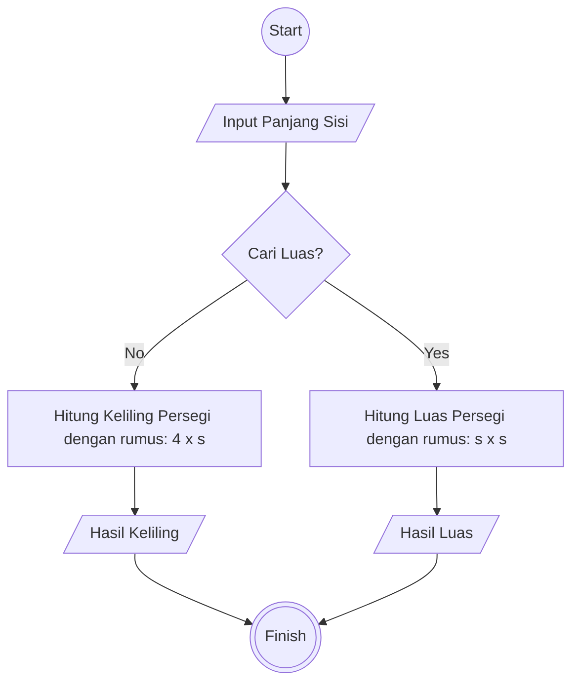

# Algoritma

## Edisi menghitung luas dan keliling persegi

```mermaid
flowchart TD

A@{shape: circle, label: 'Start'}
B@{shape: lean-r, label: 'Input Panjang Sisi'}
C@{shape: rectangle, label: 'Hitung Keliling Persegi dengan rumus: 4 x s'}
D@{shape: rectangle, label: 'Hitung Luas Persegi dengan rumus: s x s'}
E@{shape: lean-r, label: 'Hasil Keliling'}
F@{shape: lean-r, label: 'Hasil Luas'}
G@{shape: diamond, label: 'Cari Luas?'}
Z@{shape: dbl-circ, label: 'Finish'}

A-->B-->G
G-->|Yes| D
G-->|No| C
C-->E
D-->F
E-->Z
F-->Z
```
